# JSON编辑器

一个功能强大的JSON编辑器uTools插件,提供JSON格式化、验证、转换等功能。

## 功能特性

- JSON格式化与验证
- 语法高亮
- 代码折叠
- 错误提示
- 智能格式转换
  - 自动识别并格式化日志中的所有 JSON 内容
  - URL参数自动转JSON
  - XML自动转JSON
  - YAML自动转JSON
- JSON对比功能
  - 支持两个 JSON 数据的实时对比
  - 高亮显示新增内容(绿色)
  - 高亮显示删除内容(红色)
  - 高亮显示修改内容(橙色)
  - 高亮显示类型变化(紫色)
- 文件导入导出
  - 支持拖拽导入 JSON 文件
  - 支持保存为本地文件，文件名自动包含标签和时间戳
  - 支持查看和加载最近保存的文件列表
- 智能占位提示 (当编辑器为空时显示功能提示，输入内容时自动隐藏)
- 标签功能 (可为编辑器内容添加描述性标签)
- 自动消失的错误提示 (3秒后自动消失)
- 固定底部工具栏 (浅灰色背景)
- JSON排序功能
  - 支持按key值升序排列
  - 递归处理所有层级的对象
  - 保持数组顺序不变
  - 自动格式化排序后的内容
- 大数值处理
  - 自动识别并处理大整数（超过16位）
  - 保持科学计数法数值的精度
  - 自动将大数值转换为字符串以防止精度丢失
  - 支持处理嵌套对象和数组中的大数值
- Unicode转码功能
  - 支持将文本转换为Unicode编码
  - 支持将Unicode编码转换回普通文本
  - 自动处理所有非ASCII字符
  - 保持原有格式和结构不变

## 新增功能
### v1.0.1
### 历史记录
- 自动保存编辑内容（每30秒或关闭时）
- 最近50条历史记录
- 快速恢复历史内容
- 历史记录包含标签信息
- 点击历史记录按钮查看记录列表
- 点击任意历史记录可以恢复内容和标签

### 标签增强
- 使用 Ctrl/Command + T 快速切换标签输入框
- 按 Enter 或 Escape 关闭标签输入框
- 标签信息会随内容自动保存到历史记录
- 打开标签输入框时自动聚焦


### 自动保存
- 编辑器内容变化时自动保存
- 插件关闭时自动保存
- 空内容或重复内容不会保存
- 保存时自动包含标签信息
- 使用 debounce 优化保存性能

### v1.0.2
增加json差异对比功能：
使用 Monaco Editor 的内置 diff editor 功能
提供并排对比视图
支持实时编辑和对比
自动高亮差异
支持深色/浅色主题
使用方法：
点击对比按钮进入对比模式
左侧编辑器输入原始 JSON
3. 右侧编辑器输入要对比的 JSON
Monaco Editor 会自动高亮显示差异
再次点击对比按钮退出对比模式
这种方式比之前的实现更好，因为：
使用 Monaco Editor 内置的 diff 功能，更稳定可靠
提供更好的用户体验和视觉效果
支持实时编辑和对比
不需要自己实现复杂的 diff 算法和高亮逻辑

### v1.0.10 (2024-01-09)
- 新增JSON排序功能
  - 在工具栏添加排序按钮
  - 支持对JSON对象按key进行字母升序排列
  - 递归处理嵌套对象
  - 保持数组元素顺序不变
  - 排序后自动格式化
  - 支持处理各种复杂JSON结构

### v1.0.11 (2024-01-20)
- 新增大数值处理功能
  - 自动识别并处理大整数，防止精度丢失
  - 支持处理科学计数法表示的大数值
  - 递归处理嵌套结构中的大数值
  - 保持数值的完整精度
  - 示例：
    ```json
    {
      "bigInteger": "123456789987654321012345",
      "scientificNotation": "1.23456789e20",
      "longDecimal": "123456789.123456789"
    }
    ```

### 2024-12-07
增加高级筛选功能：
- 双模式筛选器
  - 文本模式：支持简单的关键字搜索
  - JS语法模式：支持高级的JavaScript表达式筛选
- 实时筛选结果
  - 自动高亮匹配内容
  - 显示完整的属性路径
  - 点击结果可快速定位
- 支持多种筛选语法
  - 对象路径语法：`.key.subkey`
  - 数组索引：`[0].items`
  - 数组过滤：`.filter(x => x.id > 100)`
  - 数组映射：`.map(x => x.name)`
  - 链式调用：`.items.filter(x => x.price > 1000).map(x => x.title)`
- UI优化
  - 独立的右侧筛选面板
  - 深色/浅色主题支持
  - 平滑的过渡动画
  - 不遮挡编辑区域
  

## 使用方法：
1. 点击底部工具栏的筛选图标打开筛选面板
2. 选择筛选模式：
   - 文本模式：直接输入关键字进行搜索
   - JS语法模式：输入JavaScript表达式进行高级筛选
3. 在输入框中输入筛选条件：
   - 文本模式示例：`name` 或 `123`
   - JS语法示例：
     - `.items` - 获取 items 数组
     - `.items.filter(x => x.id > 100)` - 筛选 id 大于 100 的项
     - `.map(x => x.name)` - 提取所有 name 字段
4. 查看筛选结果，点击结果项可以在编辑器中定位到对应位置

## 使用方法
1. JSON格式化:
   - 复制JSON文本,呼出uTools,输入"json"
   - 或直接拖拽JSON文件到输入框
   - 支持自动识别并格式化日志中的JSON内容

2. URL参数转JSON:
   - 复制URL参数字符串,呼出uTools,输入参数将自动转换

3. 日志内容格式化:
   - 支持识别并格式化日志中的 JSON 内容
   - 自动处理 body、headers 等字段中的 JSON
   - 保持非 JSON 内容的原始格式

4. 标签功能:
   - 点击底部工具栏的标签按钮或使用快捷键 Ctrl/⌘ + T
   - 在顶部输入框中输入描述性文字
   - 点击关闭按钮或再次按 Ctrl/⌘ + T 可隐藏标签输入框

5. 保存功能:
   - 点击底部工具栏的保存按钮或使用快捷键 Ctrl/⌘ + S
   - 自动生成文件名：标签名_时间戳.json
   - 支持选择保存位置
   - 自动格式化后保存

6. 文件列表功能:
   - 点击底部工具栏的文件夹图标
   - 显示最近保存的 JSON 文件列表
   - 列表按修改时间倒序排序
   - 点击列表项可直接加载文件内容

7. 历史记录功能:
   - 点击底部工具栏的历史记录按钮
   - 显示最近50条编辑记录
   - 记录包含内容、标签和时间信息
   - 点击记录可快速恢复内容和标签

8. JSON对比功能:
   - 点击底部工具栏的对比按钮进入对比模式
   - 左侧编辑器输入源 JSON
   - 右侧编辑器输入目标 JSON
   - 自动高亮显示两个 JSON 的差异:
     - 绿色: 新增的内容
     - 红色: 删除的内容
     - 橙色: 修改的内容
     - 紫色: 类型变化
   - 再次点击对比按钮退出对比模式

9. JSON排序功能:
   - 点击底部工具栏的排序按钮
   - 自动对JSON对象的key进行升序排列
   - 递归处理所有嵌套的对象
   - 保持数组元素的原始顺序
   - 排序后自动格式化显示
   - 支持处理复杂的JSON结构

10. Unicode转码功能:
    - 点击工具栏的Unicode编码按钮，将文本转换为Unicode编码
    - 点击工具栏的Unicode解码按钮，将Unicode编码转换回普通文本
    - 编码时会自动处理所有非ASCII字符
    - 解码时会自动识别所有Unicode编码并还原
    - 支持处理JSON中的所有文本内容
    - 保持原有的JSON结构和格式不变

## 测试数据
为了方便测试各项功能，项目提供了一个全面的测试数据文件 `src/test-data.json`，包含：

1. 基本数据类型：
   - 字符串（普通、空、带空格、特殊字符、Unicode）
   - 数字（整数、浮点数、正数、负数）
   - 布尔值
   - null
   - 日期时间
   - URL
   - 电子邮件

2. 数组：
   - 简单数组
   - 空数组
   - 混合类型数组
   - 对象数组

3. 对象：
   - 简单对象
   - 空对象
   - 嵌套对象（多层级）
   - 带数组的对象

4. 特殊情况：
   - 深层嵌套
   - 各种数据类型组合
   - 常见数据结构

5. 元数据：
   - 版本信息
   - 作者信息
   - 标签
   - 设置

这些测试数据可用于验证所有功能的正确性，特别是：
- 格式化功能
- 排序功能
- 折叠/展开功能
- 筛选功能
- 对比功能
- 转义功能

## 快捷键

- `Alt + F`: 重新格式化
- `Alt + C`: 压缩复制
- `Alt + \`: 压缩引号复制
- `Alt + .`: 全部折叠
- `Alt + . + Shift`: 全部展开
- `Ctrl/⌘ + T`: 显示/隐藏标签输入框
- `Ctrl/⌘ + S`: 保存文件

## 界面特性

- 固定底部工具栏
  - 浅灰色背景设计
  - 始终保持在底部
  - 包含所有常用工具按钮
- 智能输入框
  - JS过滤器输入框使用白色背景
  - 标签输入框使用白色背景
  - 深色主题下保持良好可读性
- 消息提示
  - 错误提示3秒后自动消失
  - 顶部居中显示
  - 支持手动关闭

## 开发说明

本项目使用Monaco Editor作为编辑器核心,采用Web Worker处理重任务,保证编辑器性能。

### 技术特性

- Monaco Editor集成
  - 使用Monaco Editor提供的强大编辑功能
  - 支持语法高亮和错误提示
  - 自定义主题适配
- 智能占位提示
  - 编辑器为空时自动显示功能提示
  - 输入内容时自动隐藏提示
  - 支持深色模式自适应
  - 使用CSS绝对定位实现居中显示
- 智能日志处理
  - 自动识别日志中的 JSON 内容
  - 支持多个 JSON 块同时格式化
  - 保持日志结构完整性
- UI优化
  - 固定底部工具栏
  - 自适应布局
  - 深浅色主题支持
  - 统一的输入框样式

### 技术栈

- Monaco Editor
- React
- Material-UI
- Electron
- Web Workers
- uTools API

### 项目结构说明
/
├── public/                # 静态资源目录
│   ├── index.html        # 主页面
│   └── logo.png          # 插件图标
├── plugin/               # uTools 插件目录
│   ├── dist/            # 打包输出目录
│   ├── plugin.json      # 插件配置文件
│   └── preload.js       # 预加载脚本
├── src/                 # 源代码目录
│   ├── components/      # React 组件
│   │   ├── JsonEditor.jsx     # 主编辑器组件
│   │   ├── JsonEditor.css     # 编辑器样式
│   │   ├── MessageSnackbar.jsx # 消息提示组件
│   │   └── ErrorBoundary.jsx  # 错误边界组件
│   ├── services/        # 服务层
│   │   └── JsonService.js     # JSON 处理服务
│   └── index.js         # 入口文件
├── package.json         # 项目配置文件
└── webpack.config.js    # Webpack 配置文件

# 插件截图
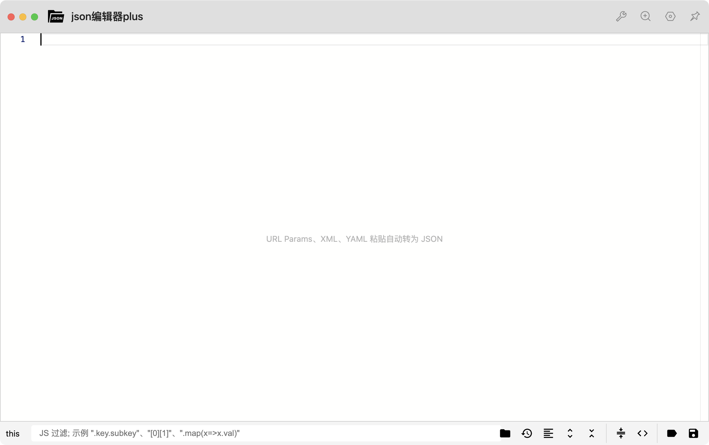
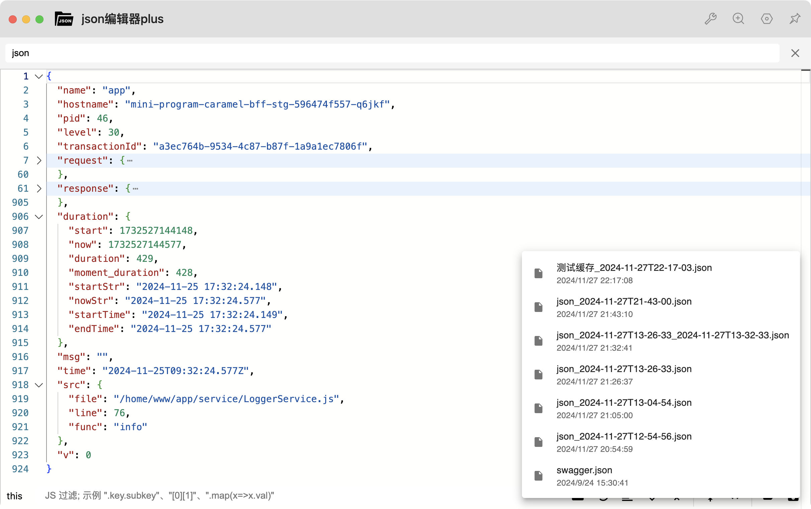
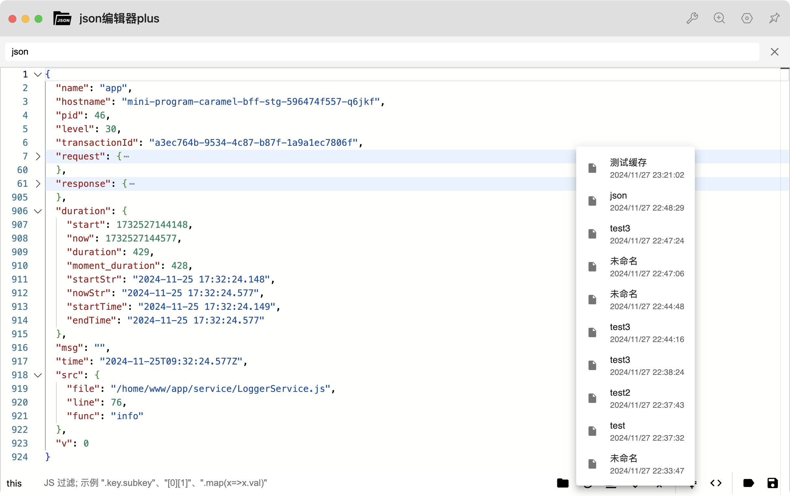
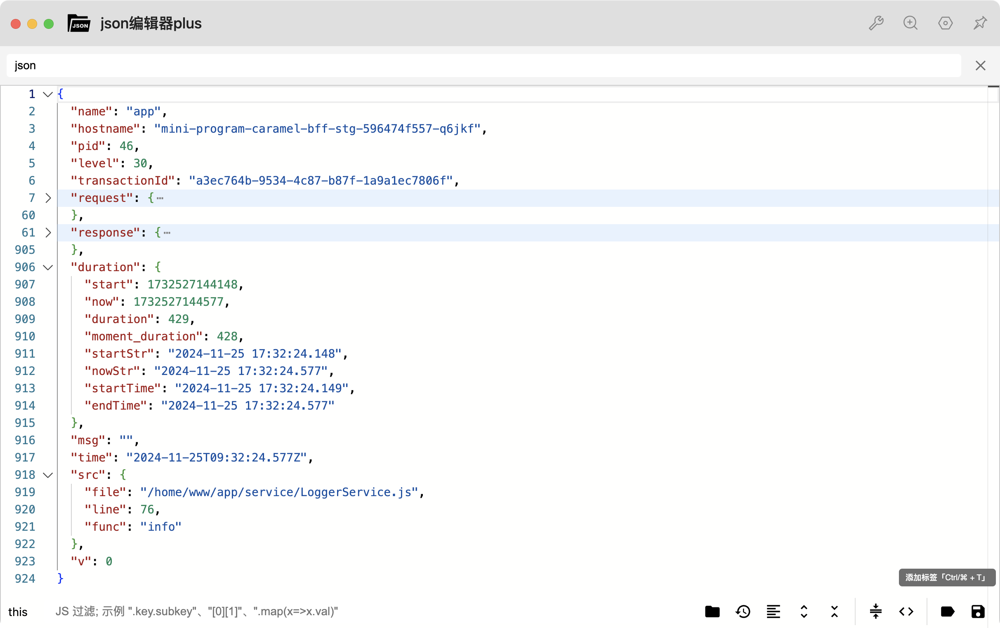
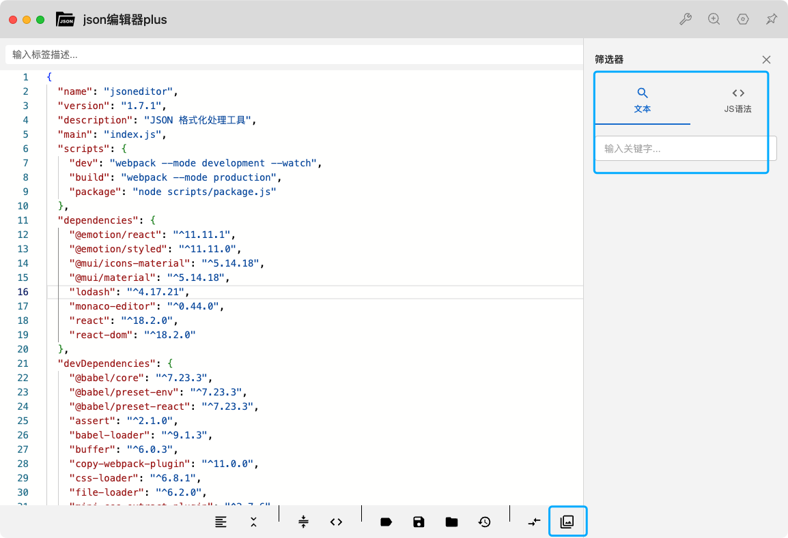
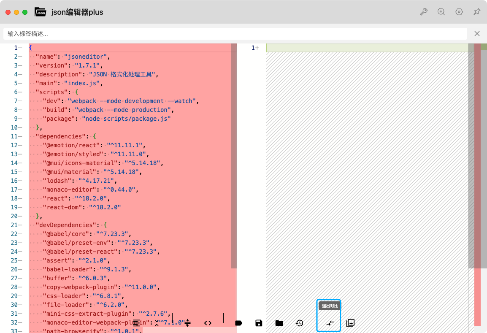
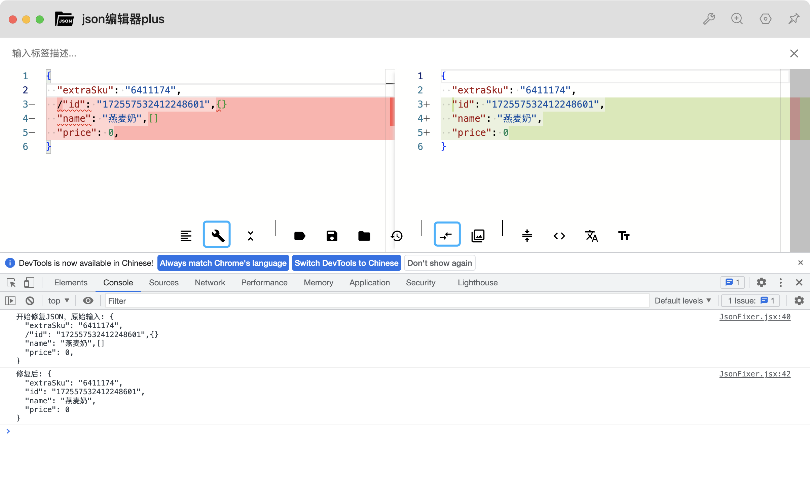
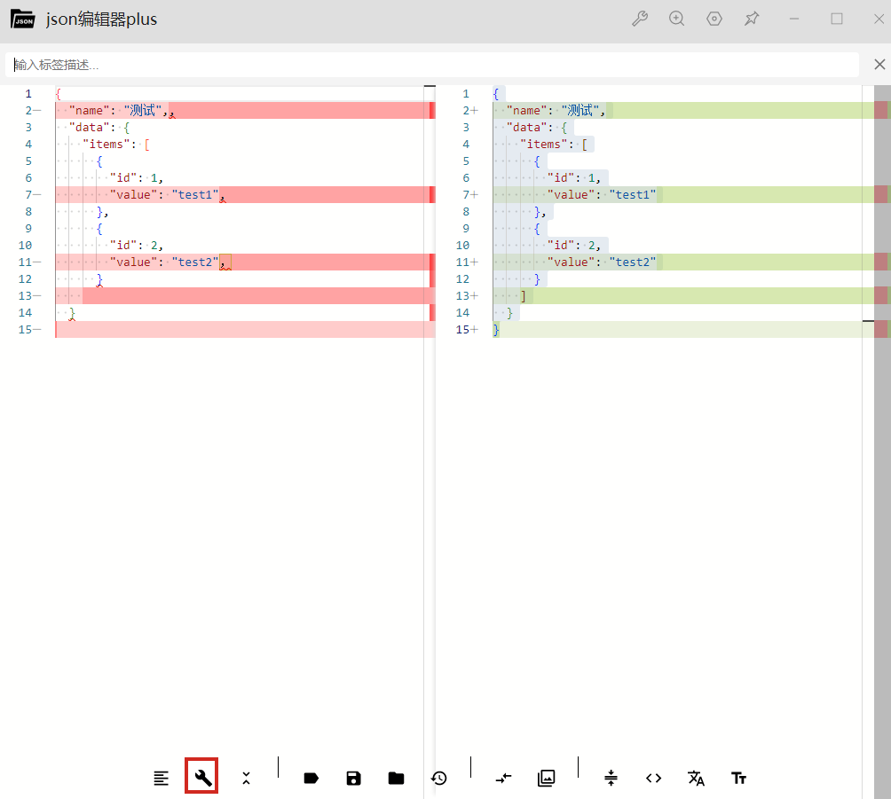
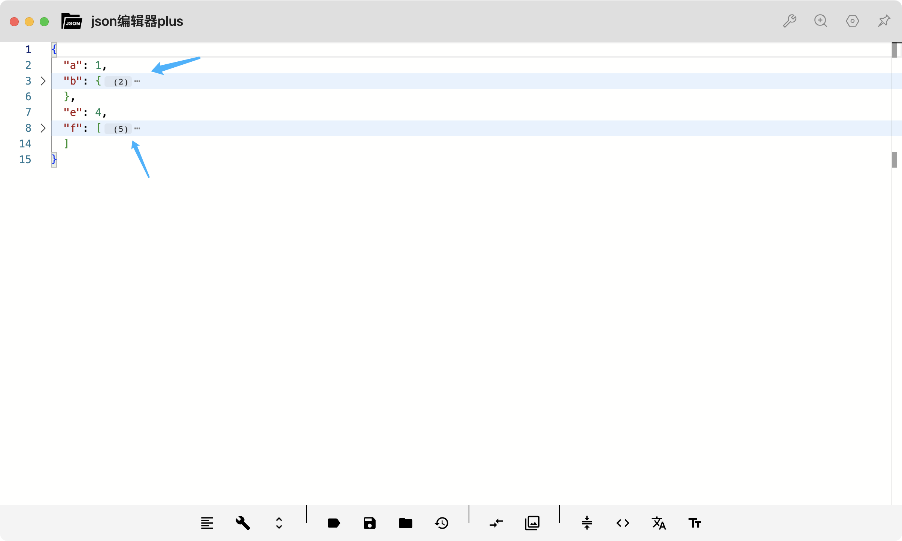
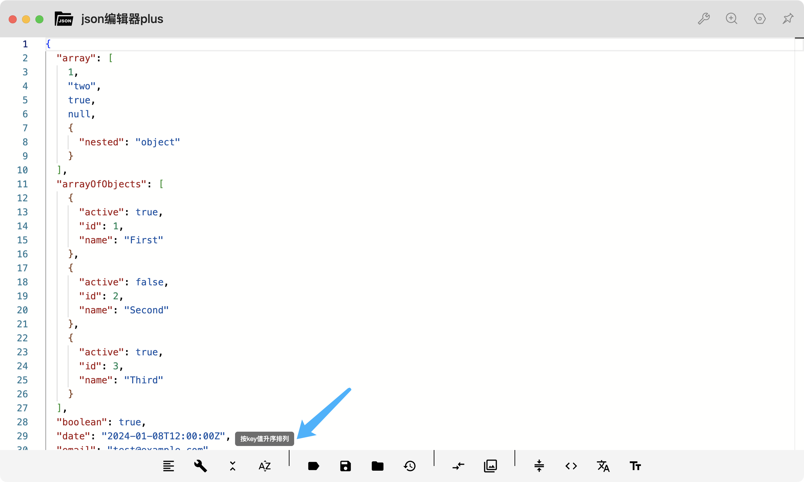
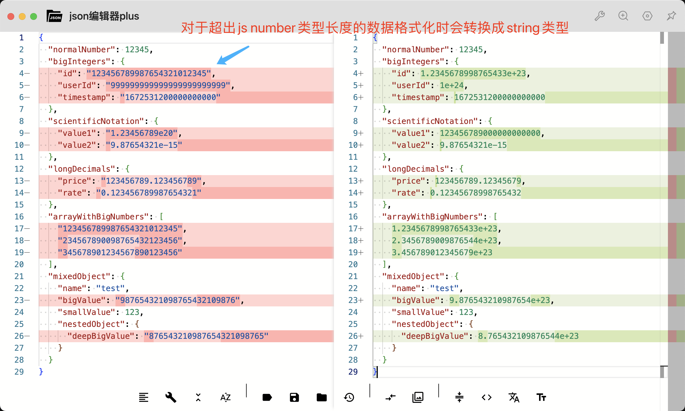

## 最新更新 (2024-12-16)

### 1. 差异对比功能增强
- 新增对比编辑器自动格式化功能
  - 左右两侧编辑器都支持实时JSON格式化
  - 智能识别标准JSON和混合内容
  - 保持光标位置和编辑体验
  - 优化了格式化性能和稳定性
- 改进了差异对比的用户体验
  - 实时显示格式化后的差异
  - 避免了格式化过程中的闪烁
  - 提升了大文件对比的性能

### 2. 智能JSON处理优化
- 新增自动识别内容类型功能
  - 标准JSON：使用JSON.stringify进行快速格式化
  - 混合内容：保持原有格式，仅格式化JSON部分
- 优化了JSON解析和格式化性能
- 改进了错误处理机制

### 3. 格式化功能增强
- 优化了缩进和换行处理
- 改进了特殊字符的处理
- 提升了大文件处理性能

### 4. 用户体验改进
- 优化了格式化过程的响应速度
- 改进了错误提示的准确性
- 增强了与编辑器的交互体验

### 5. 技术改进
- 重构了格式化核心逻辑
- 优化了代码结构
- 提升了整体性能

## 使用说明

### JSON格式化
1. 直接粘贴或输入JSON内容
2. 自动识别内容类型：
   - 标准JSON：使用JSON.stringify格式化
   - 混合内容：保持原有格式，仅格式化JSON部分

### 差异对比
1. 点击差异对比按钮进入对比模式
2. 左右两侧编辑器都支持：
   - 实时JSON格式化
   - 自动识别JSON类型
   - 保持编辑位置
3. 实时显示格式化后的差异：
   - 绿色: 新增的内容
   - 红色: 删除的内容
   - 橙色: 修改的内容
   - 紫色: 类型变化

## 注意事项
1. 大文件处理时可能需要较长时间
2. 建议定期保存重要内容
3. 如遇格式化失败，请检查JSON格式是否正确
4. 对于混合内容，建议先确保JSON部分格式正确
5. 在差异对比模式下，格式化可能会短暂影响差异显示


## 最新更新 (2024-12-17)

### 1. 转义功能增强
- 新增转义相关功能
  - 增加转义：将文本转换为转义格式
  - 去除转义：将转义文本还原为原始格式
  - 压缩转义复制：压缩并转义后复制到剪贴板
- 支持的转义字符：
  - 双引号 (")
  - 反斜杠 (\)
  - 换行符 (\n)
  - 回车符 (\r)
  - 制表符 (\t)
  - 退格符 (\b)
  - 换页符 (\f)
- 优化了转义处理逻辑
  - 智能处理双重转义
  - 正确处理特殊字符
  - 保持格式化状态

### 2. 工具栏优化
- 重新组织了工具栏按钮
  - 基本操作组：格式化、展开/折叠
  - 文件操作组：标签、保存、文件列表、历史记录
  - 视图操作组：差异对比、筛选
  - 转义操作组：压缩复制、压缩转义复制、增加转义、去除转义
- 每个功能组之间使用分隔线明确区分
- 优化了图标的选择，使功能更直观

### 3. 快捷键更新
- `Alt + X`: 增加转义
- `Alt + U`: 去除转义
- `Alt + \`: 压缩转义复制
- `Alt + C`: 压缩复制

## 使用说明

### 转义功能
1. 增加转义：
   - 点击工具栏的转义按钮
   - 或使用快捷键 `Alt + X`
   - 将文本中的特殊字符转换为转义格式

2. 去除转义：
   - 点击工具栏的去除转义按钮
   - 或使用快捷键 `Alt + U`
   - 将转义文本还原为原始格式

3. 压缩转义复制：
   - 点击工具栏的压缩转义复制按钮
   - 或使用快捷键 `Alt + \`
   - 将JSON压缩并转义后复制到剪贴板

### 注意事项
1. 转义功能主要用于处理需要在字符串中保留特殊字符的场景
2. 去除转义时会自动处理多重转义的情况
3. 建议在转义前先确保JSON格式正确
4. 转义后的文本可能会较长，注意复制时的完整性


## 最新更新 (2024-12-30)

### JSON修复功能增强
- 智能修复非标准JSON
  - 自动处理多余的逗号
  - 自动修复缺失的引号
  - 自动修复未闭合的括号
  - 自动处理全角字符（如中文引号、逗号、冒号）
  - 自动处理非法字符
  - 保持原有的数据结构和格式
- 支持多层嵌套结构
  - 正确处理嵌套的对象和数组
  - 保持嵌套层级不变
  - 保持原有的缩进格式
- 友好的错误提示
  - 显示具体的错误位置
  - 提供清晰的错误描述
  - 自动尝试多种修复策略

### 使用说明

#### JSON修复功能
1. 自动修复：
   - 编辑器会自动检测非标准JSON
   - 自动修复常见格式问题
   - 保持原有的数据结构

2. 支持的修复类型：
   - 多余的逗号
   - 缺失的引号
   - 未闭合的括号
   - 全角字符（中文引号、逗号、冒号）
   - 非法字符

3. 错误提示：
   - 显示具体的错误位置
   - 提供清晰的错误描述
   - 建议可能的修复方案

### 注意事项
1. 修复功能会尽可能保持原有的数据结构和格式
2. 对于复杂的嵌套结构，建议检查修复后的结果
3. 如果修复后仍有问题，可以查看错误提示获取更多信息
4. 建议在修复前备份重要数据


## 更新日志

### 2025-01-03
- 新增功能：JSON折叠计数
  - 在折叠JSON对象或数组时，会在行尾显示计数信息
  - 对象显示第一层属性的数量，如 `(3)` 表示有3个顶层属性
  - 数组显示元素的数量，如 `(5)` 表示数组有5个元素
  - 展开时自动隐藏计数信息
  - 支持深色/浅色主题

### 使用说明
1. 折叠计数功能
   - 点击行号左侧的折叠图标或使用全部折叠按钮时，会自动显示计数
   - 对象计数：只统计第一层的属性数量，不包括嵌套对象的属性
   - 数组计数：显示数组中的元素总数
   - 展开时计数信息会自动消失
   - 计数显示会根据编辑器主题自动调整样式

### 2025-01-04
- 新增功能：ESC键关闭差异对比
  - 在差异对比模式下，按ESC键会关闭差异对比并恢复原始内容
 

## 网站部署
除了作为 uTools 插件使用，本项目也支持部署为独立的网站。

### 开发环境
```bash
# 安装依赖
npm install

# 启动开发服务器
npm run dev:web
```

### 生产环境构建
```bash
# 构建网站版本
npm run build:web

# 本地预览构建结果
npm run serve:web
```

### 部署说明
1. 运行 `npm run build:web` 命令会在 `web-dist` 目录生成优化后的静态文件
2. 将 `web-dist` 目录下的所有文件上传到你的网站服务器
3. 确保你的网站服务器配置正确：
   - 设置正确的 MIME 类型
   - 启用 gzip 压缩
   - 配置适当的缓存策略
   - 如果使用 CDN，确保配置正确的缓存刷新规则

### 浏览器兼容性
- Chrome >= 60
- Firefox >= 60
- Safari >= 12
- Edge >= 79


